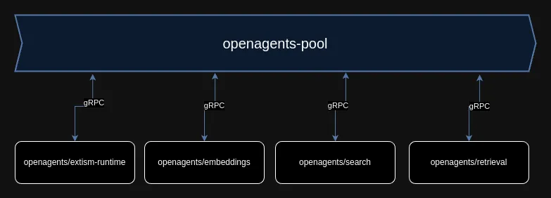

# OpenAgents - gRPC protocol

The protocol definition that is used by OpenAgents nodes to communicate with a pool.




The protocol is defined as protobuf 3 messages and built with gRPC.

## Installation with package managers

### Python

```bash
pip install openagents-grpc-proto
```

### NodeJS
```bash
npm install @openagentsinc/openagents-grpc-proto
```
### PHP
TODO

## Building

### Clients

```
bash build-javascript.js
bash build-php.sh
bash build-python.sh
```

### Documentation
```
bash build-docs.sh
```

## Packages

Prebuilt packages are available in the `releases` page.